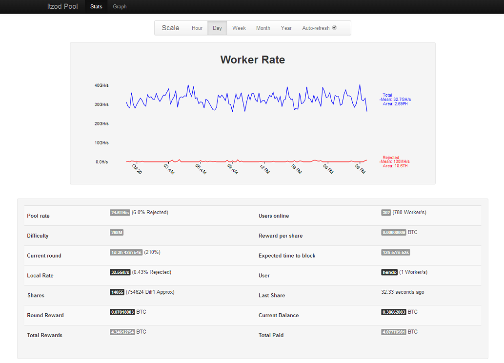

itzodmon
========

https://pool.itzod.ru bitcoin mining monitor.

Itzodmon is a web app for monitoring a user's workers on pool.itzod.ru bitcoin mining pool.
It is heavily based on the p2pool extended frontend (by hardcpp) and provides up-to-date stats and graphs 
for a user's performance and that of the itzod pool.

Screenshot
----------

Example screenshot of itzodmon web page:

Installation
------------

Install using ``pip``: ::

	pip install itzodmon

Getting Started
---------------

This guide assumes you already have an account on https://pool.itzod.ru

1) ensure you are logged in and navigate to the itzod options page at:
 https://pool.itzod.ru/tweak

2) Copy your API Key listed at the bottom of the page

3) Start the itzodmon web server from the command line, passing in your api key ::

	itzodmon --key hendo_1234567890abcdef

4) On the same host, open a web browser and navigate to http://127.0.0.1:8000

You should now be presented with a webpage containing the specified user's stats.
Graph history will be built up over time, while the webserver is running and the itzod pool is contactable.

Issues
------

Source code for ``itzodmon`` is hosted on `GitHub`_. Any bug reports or feature
requests can be made using GitHub's `issues system`_.

.. _GitHub: https://github.com/shendo/itzodmon
.. _issues system: https://github.com/shendo/itodmon/issues
